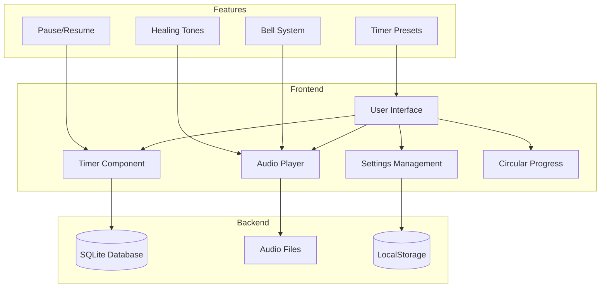

# Meditation Timer App Plan

## Flowchart



## Key Components and Implementation Details

1. Core Features:
   - Timer with presets (5, 10, 15, 20 minutes + custom)
   - Pause/Resume functionality
   - Circular progress indicator
   - Background healing tones
   - Bell system (start/end bells and interval bells)
   - Settings persistence in LocalStorage
   - Session tracking in SQLite

2. Database and Storage:

```sql
-- User Settings (LocalStorage)
{
    "interval_duration": 120,
    "start_bell_sound": "singing-bowl-1",
    "interval_bell_sound": "tingsha-1",
    "last_timer_duration": 600,
    "selected_frequency": 432,
    "theme": "light"
}

-- Meditation Sessions (SQLite)
CREATE TABLE sessions (
    id INTEGER PRIMARY KEY,
    duration INTEGER,
    date TIMESTAMP,
    completed BOOLEAN,
    healing_tone_freq INTEGER,
    interval_bells BOOLEAN,
    interval_duration INTEGER,
    notes TEXT
);
```

3. Audio Implementation:
   - Predefined audio files in static/audio/
   - Bell sounds: singing bowl and tingsha options
   - Solfeggio Frequencies (Hz):
     - 396 (UT) - Liberating guilt and fear
     - 417 (RE) - Facilitating change
     - 432 (MI) - Universal harmony
     - 528 (FA) - Transformation and miracles
     - 639 (SOL) - Connecting relationships
     - 741 (LA) - Expression/Solutions
     - 852 (SI) - Returning to spiritual order
     - 963 (OM) - Divine consciousness
     - 174 (Foundation) - Natural anesthetic

4. Component Structure:

```javascript
// routes/
  +page.svelte           // Main meditation interface
  settings/+page.svelte  // Settings page
  stats/+page.svelte     // Meditation statistics

// lib/
  components/
    Timer.svelte         // Timer with pause/resume
    PrepTimer.svelte     // Preparation countdown
    Progress.svelte      // Circular progress
    AudioPlayer.svelte   // Audio handling
    BellSelector.svelte  // Bell sound options
    FreqSelector.svelte  // Healing tone selector

  stores/
    settings.js          // LocalStorage settings
    session.js          // Session management

  db/
    database.js         // SQLite operations
```

5. Technical Considerations:

   a. Error Handling:
   - Audio loading failures
   - Database connection issues
   - LocalStorage unavailability
   - Background tab audio interruption
   - Browser compatibility checks

   b. Testing Strategy:
   - Unit tests for timer logic
   - Integration tests for audio system
   - E2E tests for full meditation flow
   - LocalStorage/SQLite state management
   - Browser compatibility testing
   - Offline functionality testing

   c. Performance:
   - Audio preloading
   - Efficient progress bar animation
   - Smooth timer updates
   - Background tab behavior
   - Memory management for long sessions

6. Browser Requirements:
   - Modern browsers with Web Audio API support
   - LocalStorage enabled
   - JavaScript enabled
   - Recommended: Chrome 70+, Firefox 63+, Safari 12+
